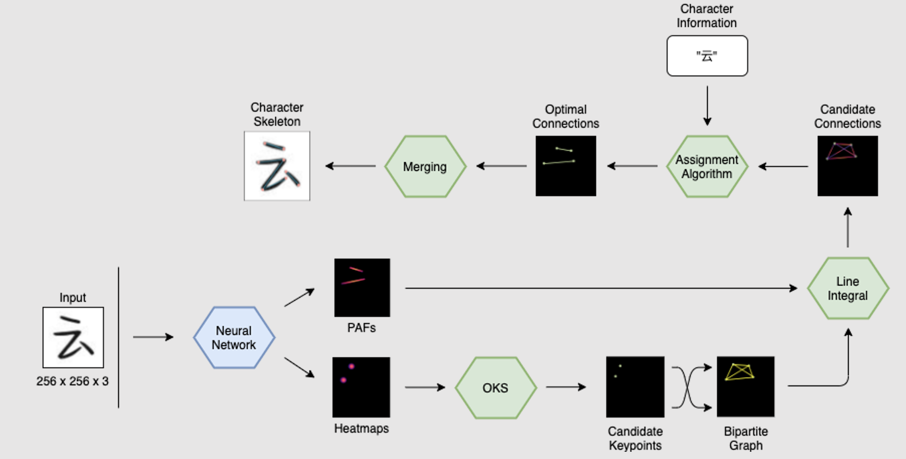
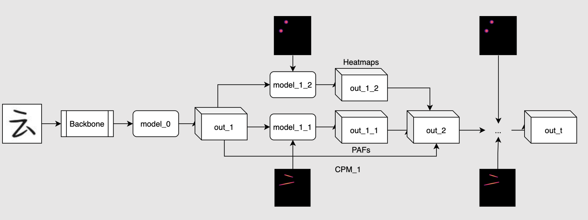
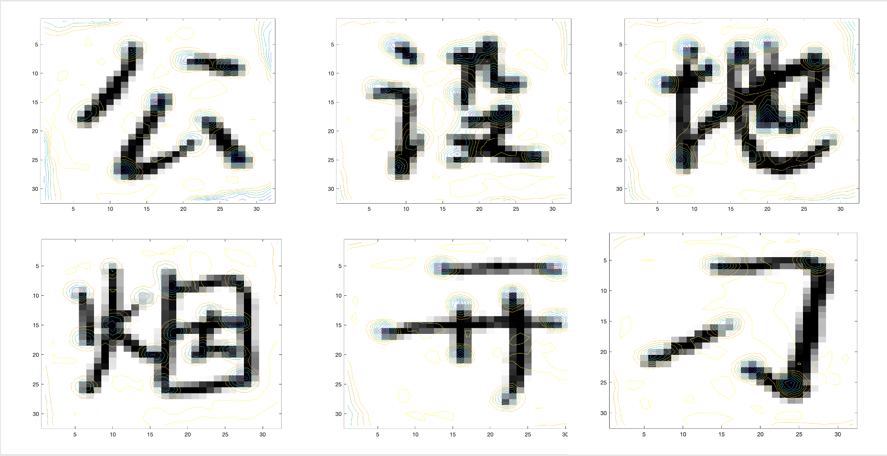

## Chinese Character Structure Detection

🏆 The third prize of the 14th National College Student Software Innovation Competition.

### Overall Procedure



### Model 




### Prepare Dataset
1. Put the the annotated dataset in `data` directory.
2. run `python -m src.preprocess.peanut`

We have annotated part of the Chinese handwriting character dataset, please refer to [ccsa](https://github.com/wbxl2000/ccsa) for more details.

### Train

Run base network
```
python -m src.preprocess.run 'train' 'base' --batch-size=16 --num-workers=0 --epoch=50 --step-size=5 --lr=3e-4 --use-gpu --gpu=0 --apex
```

Run refinement network
```
python -m src.preprocess.run 'train' 'refinement' --batch-size=16 --num-workers=0 --epoch=10 --step-size=5 --lr=5e-3 --use-gpu --gpu=0 --apex
```

Run classification network to get a pretrained model
```
python -m src.preprocess.run 'train' 'cls' --batch-size=16 --num-workers=0 --epoch=10 --step-size=5 --lr=5e-3 --use-gpu --gpu=0 --apex
```

### Inference
Run inference model, using `--snapshot` to specify model weights
```
python -m src.preprocess.run 'test' 'openpose' --batch-size=32 --num-workers=0 --use-gpu --gpu=2 --apex --reinforcement --snapshot='./checkpoints/openpose_model_apex_ep2.pt'
```

### Visualize Results
```
python -m src.preprocess.run 'view' 'base'
```

## Results

Heatmap Results



Character Structure Detection


## Contributors
Team Members:
[Chuyang](https://github.com/ZhaoChuyang), [QER](https://github.com/wbxl2000), [LBY](https://github.com/Eirc-Whyte), [XRZ](https://github.com/RzHsueh)